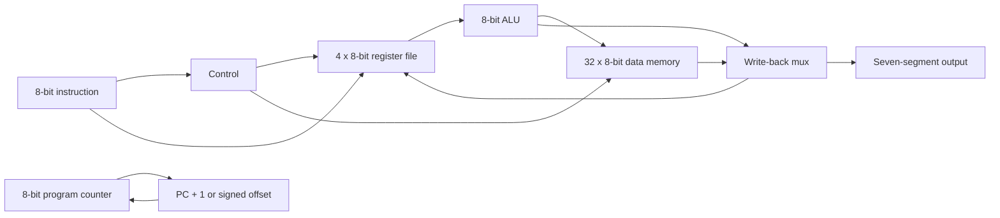
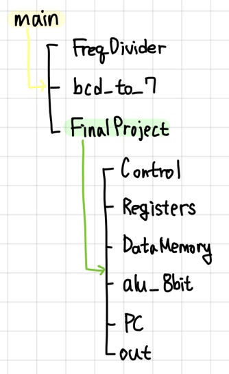
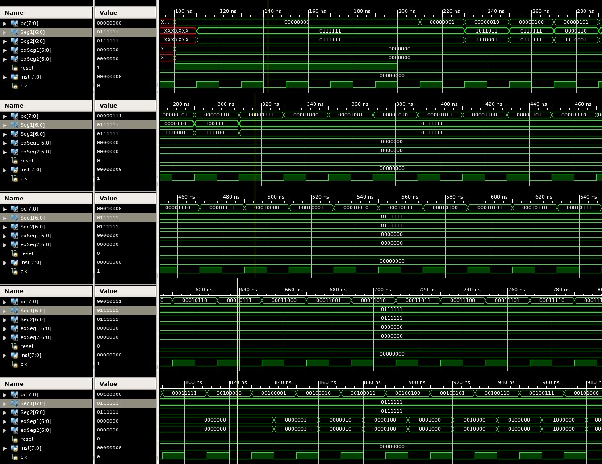
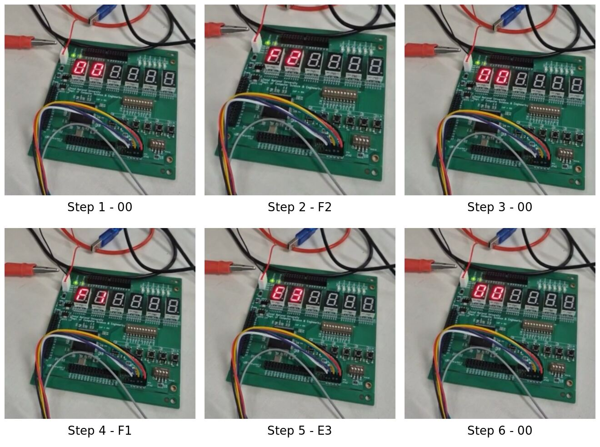

# 8-Bit Verilog Processor on FPGA

An educational 8-bit processor implemented in Verilog, simulated and synthesized in Xilinx ISE, and validated on an FPGA board. The processor executes a compact custom instruction set with `ADD`, `LOAD`, `STORE`, and PC-relative `JUMP` operations.

This was developed as a team final project for the Spring 2025 Logic Design course at Seoul National University. Starting from a course-provided datapath specification, our team implemented and integrated the RTL modules, debugged the complete system, and verified its behavior in simulation and on hardware.

## What We Built

- An 8-bit datapath controlled by a 2-bit opcode
- Four 8-bit general-purpose registers
- A 32 x 8-bit data memory
- An 8-bit ALU and multiplexed write-back path
- An 8-bit program counter with signed PC-relative jumps
- A 50 MHz-to-1 Hz clock divider for visible, step-by-step execution
- Hexadecimal output on two seven-segment displays

## Architecture



The original module hierarchy recorded during development is shown below.



## Instruction Format

| Bits | Field |
| --- | --- |
| `[7:6]` | Opcode |
| `[5:4]` | Source register `rs` |
| `[3:2]` | Source or destination register `rt` |
| `[1:0]` | Destination register `rd` or signed immediate |

| Opcode | Instruction | Behavior |
| --- | --- | --- |
| `00` | `ADD` | `rd <- rs + rt` |
| `01` | `LOAD` | `rt <- Memory[rs + sign_extend(imm)]` |
| `10` | `STORE` | `Memory[rs + sign_extend(imm)] <- rt` |
| `11` | `JUMP` | `PC <- PC + 1 + sign_extend(imm)` |

Register and memory reads are combinational. Register, memory, and PC updates occur on the rising clock edge, while reset is asynchronous.

## RTL Modules

| Module | Responsibility |
| --- | --- |
| `main` | FPGA-facing top level, divided clock, processor, and display integration |
| `FinalProject` | Processor datapath and control integration |
| `Control` | Opcode decoding and control-signal generation |
| `Registers` | Four-register file with two read ports and one write port |
| `DataMemory` | 32-byte memory with combinational reads and clocked writes |
| `alu_8bit` | 8-bit arithmetic and logic operations |
| `PC` | Program-counter state and asynchronous reset |
| `out` | Write-back value capture for display |
| `bcd_to_7` | Hexadecimal-to-seven-segment decoding |
| `FreqDivider` | 50 MHz-to-1 Hz clock division |

## Verification

The verification program exercises all four instructions as well as register and memory reads and writes. A jump skips one instruction, producing six observable display states:

```text
00 -> F2 -> 00 -> F1 -> E3 -> 00
```

### Functional Simulation

The following Xilinx ISE waveform captures are taken from the original project report. They show the program counter, instruction input, reset, clock, and seven-segment outputs across the test sequence.



### FPGA Validation

After synthesis, implementation, and pin assignment, the processor was deployed to the FPGA board. The measured display sequence matched the expected results from simulation.



## Debugging Highlights

During integration, we used waveform analysis and internal-signal tracing to diagnose and correct:

- Read/write timing errors caused by making both operations clock-dependent
- Incorrect ALU-control wiring across non-`ADD` instructions
- Module-interface and signal-naming mismatches
- Synthesis removal of submodules whose internal signals were not observable

## Repository Layout

```text
.
|-- rtl/                     # Synthesizable Verilog modules
|-- sim/TopSystem.v          # Instruction memory used for verification
|-- constraints/             # Xilinx UCF pin assignments
|-- docs/                    # Original design and validation artifacts
|-- .gitignore
`-- README.md
```

## Toolchain

- Verilog HDL
- Xilinx ISE
- Xilinx UCF constraints
- FPGA synthesis, implementation, and hardware validation

To rebuild the project, create a Xilinx ISE project for the target board, add the files in `rtl/`, set `main` as the top-level module, and add `constraints/FinalProject.ucf`. The `sim/TopSystem.v` module contains the instruction sequence used during verification. Vendor-generated build products are intentionally excluded from this repository.

## Project Context

This repository preserves the original RTL and selected dated verification artifacts from the team project. The full report is not included because it contains student-identifying information.
